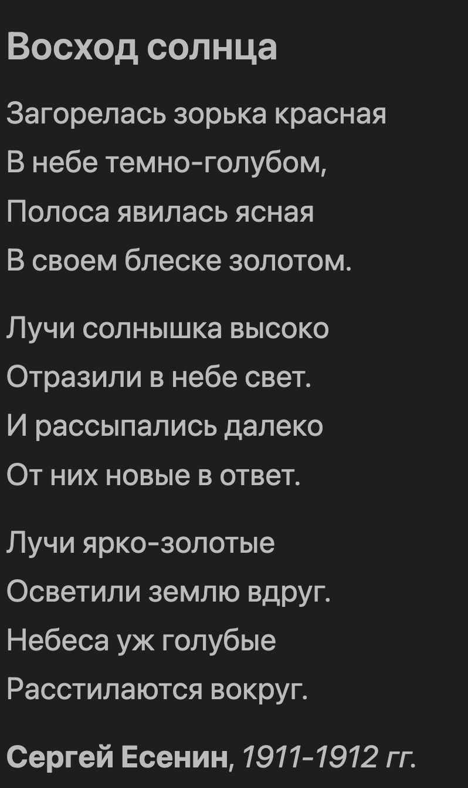

# 05-practice

### Ожидаемый результат


### Содержимое файла
[05-practice.txt](./05-practice.txt)

```
Восход солнца
Загорелась зорька красная
В небе темно-голубом,
Полоса явилась ясная
В своем блеске золотом.
Лучи солнышка высоко
Отразили в небе свет.
И рассыпались далеко
От них новые в ответ.
Лучи ярко-золотые
Осветили землю вдруг.
Небеса уж голубые
Расстилаются вокруг.
Сергей Есенин, 1911-1912 гг.
```
