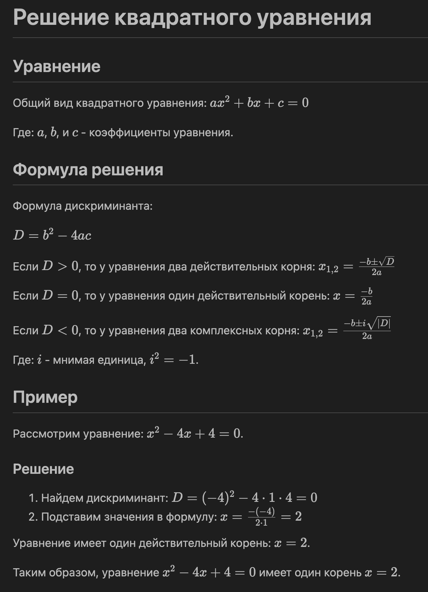

# 13-practice

### Ожидаемый результат


### Содержимое файла
[13-practice.txt](./13-practice.txt)

```
# Решение квадратного уравнения

## Уравнение

Общий вид квадратного уравнения:
ax^2 + bx + c = 0

Где: a, b, и c - коэффициенты уравнения.

## Формула решения
Формула дискриминанта:

D = b^2 - 4ac

Если D > 0, то у уравнения два действительных корня:
x 1,2 = (-b +- sqrt[D])/2a

Если D = 0, то у уравнения один действительный корень:
x = -b/2a

Если D < 0, то у уравнения два комплексных корня:
x 1,2 =(-b +- i * sqrt[|D|])/2a

Где: i - мнимая единица, i^2 = -1
## Пример
Рассмотрим уравнение: x^2 - 4x + 4 = 0.

### Решение
1. Найдем дискриминант:
D = (-4)^2 - 4 * 1 * 4 = 0
2. Подставим значения в формулу:
x = -(-4)/(2 * 1) = 2

Уравнение имеет один действительный корень: x = 2.

Таким образом, уравнение x^2 - 4x + 4 = 0 имеет один корень x = 2.
```
